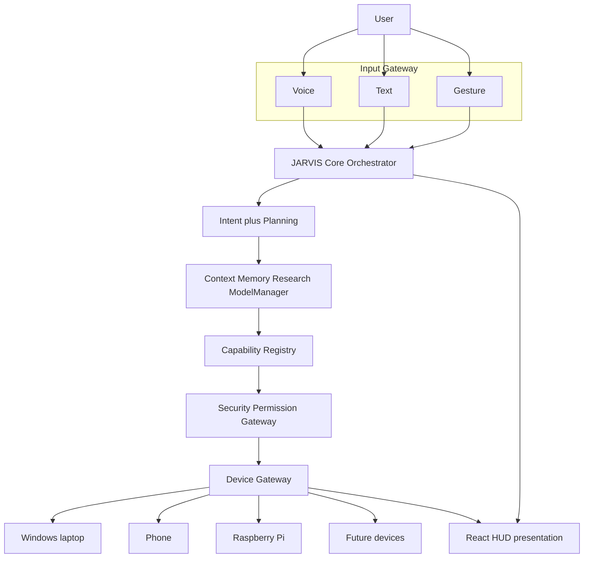

# NAVEEN / JARVIS — Master Architecture

Permanent system blueprint for NAVEEN / JARVIS: a long-term **standalone personal AI assistant and second brain**.

Agent-facing engineering rules: [`../AGENTS.md`](../AGENTS.md).

This document describes the **target architecture**, maps it onto the **current repository**, and records **locked vs open** decisions. It does not choose a permanent LLM, STT, TTS, database, or cloud vendor.

---

## 1. Goals

- A personal assistant that accepts **voice, text, and (later) gesture**, plans work, uses tools, remembers what should be remembered, and researches when it does not know.
- **Modular, provider-independent, model-independent, replaceable, upgradeable, hardware-independent, secure, offline-first.**
- Swap Gemma → another model, Ollama → another runtime, whisper.cpp or sherpa-onnx → another STT, Kokoro → another TTS, SQLite/vector store → another memory, laptop → phone / Raspberry Pi, HUD → another UI **without rewriting Core**.
- Run usefully on the initial target: **Windows, 8 GB RAM, no NVIDIA GPU, CPU-focused local inference**, **Tamil + English + mixed Tamil–English**, offline-first.
- Treat security, permissions, and audit as first-class — not an afterthought bolted onto the HUD.

## 2. Non-goals

- Embedding cognition in React / Three.js components.
- Hardcoding a single commercial API as “the brain.”
- Rebuilding whisper, ONNX VAD, llama.cpp, or vector search from scratch.
- Unrestricted self-modification or silent privilege escalation.
- Persisting every utterance into long-term memory.
- Assuming powerful GPUs, unlimited RAM, or always-on network.
- Using browser `SpeechRecognition` or running STT/LLM inference in the webview.
- Treating Tauri capability JSON as the JARVIS tool registry.
- Shipping cloud-required features as the default path.

---

## 3. Target architecture

```text
User
  → Input Gateway          (voice / text / gesture)
  → JARVIS Core / Orchestrator
  → Intent + Planning
  → Context / Memory / Research / Model Manager
  → Capability Registry
  → Security / Permission Gateway
  → Device Gateway
  → Laptop / Phone / Future Devices
```



The HUD is a **subscriber and display**, not a box on the privileged path.

---

## 4. Layer responsibilities

| Layer | Responsibility |
| --- | --- |
| **Input Gateway** | Normalize voice transcripts, typed text, and future gestures into a single Core inbox. Does not plan or call tools. |
| **JARVIS Core / Orchestrator** | Session, turn lifecycle, routing to planners, emitting UI/core events. No React imports. |
| **Intent + Planning** | Classify intent, produce a plan (possibly multi-step), request research when uncertain. |
| **Context** | Assemble working context for a turn (not durable memory). |
| **Memory** | First-class stores with typed namespaces; write policies; recall APIs. |
| **Research** | Capability: gather, verify, synthesize; optional memory write. |
| **Model Manager / Router** | Select a `ModelProvider` per task; enforce resource policy; load/unload. |
| **Capability Registry** | Named tools with schemas, permissions, risk, adapters, verification. |
| **Security / Permission Gateway** | Authn/authz, deny-by-default, confirmation, secrets, audit, network, kill switch. Every privileged call passes here. |
| **Device Gateway** | Stable traits for audio, telemetry, FS, processes, sensors. Per-device adapters. |
| **Presentation** | React HUD + Nova Core visuals. Display and non-privileged input only. |

### 4.1 Current repository mapping

| Path | Role today | Target role |
| --- | --- | --- |
| `src/App.tsx` | Composes HUD; polls telemetry; **starts microphone** | HUD shell only; subscribe to events |
| `src/components/hud/` | Glass HUD panels | Keep as dumb views |
| `src/components/core/` | Three.js Nova Core | Keep as visual engine |
| `src/components/speaking/` | Unused speaking visual | Optional visual for `speaking` state |
| `src/config/theme*.ts`, `visualState.ts`, `visualProfiles.ts` | Theme + visual profiles | Presentation only |
| `src/config/hudModel.ts` | Presentation types (mostly unused) | HUD view-model fed by Core/device events |
| `src/config/assistantConfig.ts` | Display names | Branding only — not model choice |
| `src/state/assistantState.ts` | UX state store | Map **from** Core events; never become Core |
| `src/services/native/tauriBridge.ts` | `invoke` wrappers | Thin client; add event listeners |
| `src/services/voice/*`, `stt/*` | Interfaces + stub STT factory; `VoiceController` unwired | TS side of native STT events; inference stays native |
| `src/services/assistantEnvironment.ts` | Unused Tauri/browser detect | Optional presentation hint only |
| `src-tauri/src/lib.rs` | `jarvis_ping`, `get_system_info`, mic commands | Device Gateway host + Core host |
| `src-tauri/src/audio.rs` | CPAL capture, RMS only; PCM dropped | Audio adapter: PCM tap → VAD → STT |
| `src-tauri/capabilities/default.json` | `core:default` IPC ACL | Stay IPC ACL; not tool registry |
| `src-tauri/tauri.conf.json` | Product name JARVIS; CSP `null`; template identifier | Harden host; still not Core |

**Not present:** orchestrator, intent/planning, memory store, research engine, model manager, capability registry, runtime permission gateway, TTS, wake word, VAD, real STT, local LLM.

---

## 5. Interfaces and boundaries

Use traits/interfaces + config. Core depends on abstractions, not crates named after a vendor.

Conceptual contracts (names are illustrative):

```text
InputEvent { source: voice|text|gesture, text, locale?, utterance_id }

SttProvider { start, stop, abort; events: partial, final, error }
VadProvider { on_pcm → speech_start / speech_end / is_speech }
TtsProvider { speak, stop; events: audio_out / done }
ModelProvider { complete | stream; modality; resource_cost }
EmbeddingProvider { embed }
MemoryStore { recall, write, forget, namespaces }
Capability {
  id, input_schema, output_schema,
  permissions[], risk, device_requirements,
  adapter, verification
}
DeviceGateway {
  audio: AudioAdapter
  telemetry: TelemetryAdapter
  ...
}
SecurityGateway { authorize(action) → Allow | Deny | Confirm }
ResourceManager { snapshot hardware; can_load(model); unload }
```

**Forbidden crossings**

- React component → OS privileged API (except via Core/Gateway).
- Webview → raw PCM / ONNX / llama inference.
- Capability adapter → skip Security Gateway.
- MCP client → host tools without JARVIS permission + audit.
- Core → `C:\Users\...` hardcoded paths or API keys.
- HUD `MemoryPanel` → SQL/vector writes.

**Two “capability” systems (do not conflate)**

1. **Tauri ACL** (`src-tauri/capabilities/default.json`): which webview may call which IPC commands.
2. **JARVIS Capability Registry** (future Core): which assistant tools exist and who may run them.

---

## 6. Data flow

### 6.1 Text turn (target)

```text
User types
  → Input Gateway (non-privileged)
  → Core inbox
  → Intent + Plan
  → Context assembly (working memory + selected long-term)
  → Model Manager (optional generation)
  → Capability Registry (if tools needed)
  → Security Gateway
  → Device Gateway / adapters
  → Results back to Core
  → Events to HUD (response, progress, state)
```

### 6.2 Voice turn (target)

See [§8 Voice pipeline](#8-voice-pipeline).

### 6.3 Current (as implemented)

```text
Mic → CPAL → RMS mutex → JS poll 120ms → VoicePanel waveform
sysinfo → JS poll 2s → SystemPanel (CPU/RAM/uptime)
jarvis_ping → console "CORE_ONLINE"  (health string only)
STT factory → no-op
VoiceController → not mounted
```

---

## 7. Security flow

Defense in depth. Deny by default.

```text
Request (UI event, transcript, MCP, capability call)
  → Authentication (who is acting)
  → Authorization / policy (is this allowed)
  → Risk class
       low    → allow + audit
       medium → allow if session trusted + audit
       high   → explicit confirmation and/or re-auth + audit
  → Secrets check (never inject raw secrets into prompts or UI)
  → Network policy (offline/safe mode may deny)
  → Sandbox / adapter execution
  → Audit log
  → Optional rollback / kill switch
```

Must include, as the system grows:

- Authentication and authorization
- Least privilege
- Deny-by-default policies
- Capability-level permissions
- Dangerous-operation confirmation
- Secrets isolation (not in git, HUD, or model prompts)
- Audit logs
- Sandboxing / isolation
- Network policy
- Safe / offline mode
- Kill switch
- Rollback
- Suspicious-activity detection
- Prompt-injection defenses for **external** content (web, files, MCP, tool output)
- Secure update process

**Hard prohibitions**

JARVIS must never:

- bypass its own permission system
- silently elevate privileges
- disable authentication
- reveal secrets
- silently grant itself new capabilities
- execute arbitrary untrusted code without policy approval
- modify its security layer without controlled review

“User said so” is **not** sufficient for dangerous actions (destructive FS, shell, payments, identity, security-config changes). Those require appropriate authentication and/or explicit confirmation.

External tool protocols (including MCP) **must not** bypass this gateway.

---

## 8. Voice pipeline

### 8.1 Target

```text
Microphone
  → Device Gateway audio adapter (CPAL on current laptop)
  → PCM pipeline (resample to provider needs, typically 16 kHz mono)
  → VAD (Silero or equivalent behind VadProvider)
  → SttProvider (sherpa-onnx, whisper.cpp, or other)
  → text event (partial / final)
  → JARVIS Core (same inbox as typed text)
```

- Audio buffers and STT inference stay **native**.
- HUD receives **levels, VAD state, transcripts, errors** — not PCM (except an explicit debug flag).
- `SttProvider` remains an interface. Engines are adapters selected by configuration.

### 8.2 Replaceable STT / VAD candidates (not locked)

| Candidate | Intended use | Notes |
| --- | --- | --- |
| **Silero VAD** | Gate utterances on CPU | Prefer via sherpa-onnx bundled VAD or a single ONNX runtime; not HUD RMS |
| **sherpa-onnx** | First streaming STT candidate | CPU ONNX; evaluate Tamil + English + code-mix |
| **whisper.cpp** | Offline quality / fallback STT | CPU; small multilingual models on 8 GB; not the webview |

Do not rebuild these. Wrap them. Do not make any of them the only possible backend.

### 8.3 Current voice code

- Native: `src-tauri/src/audio.rs` computes RMS and **drops PCM**.
- UI meter: `src/components/hud/VoicePanel.tsx` (display noise gate `0.028` is **not** VAD).
- Contracts: `src/services/voice/stt/sttTypes.ts`, stub `createSttProvider()` in `sttProvider.ts` (explicitly forbids browser SpeechRecognition).
- `VoiceController` exists but is **not** used by `App.tsx`.
- `App.tsx` currently **owns mic start/stop** — conflict with the rule that UI must not own microphone lifecycle. Future work moves session control to Device Gateway + Security Gateway.

### 8.4 Language

Target languages: Tamil, English, mixed Tamil–English. Locale and model choice are **configuration + Model/STT manager**, not hardcoded strings in Core. Offline-first: network STT is optional and permissioned.

---

## 9. Model architecture

```text
Task (chat, plan, embed, classify, …)
  → ModelRouter / Model Manager
  → ModelProvider adapter
       local GGUF / llama.cpp
       Ollama
       future providers
       optional cloud (later, permissioned)
  → Completion / stream
```

Rules:

- No model or provider is permanent.
- Gemma, Ollama, llama.cpp, etc. are **candidates**.
- Resource Manager participates: detect CPU/RAM/GPU/VRAM; refuse simultaneous heavy loads; unload/switch; pick smaller models on 8 GB CPU-only machines.
- Cloud providers default **off**; enabling them is a security + network policy decision.

---

## 10. Memory architecture

Memory is first-class and native. **Do not blindly save every conversation.**

| Kind | Purpose |
| --- | --- |
| Working context | Current turn / active plan |
| Temporary session | Ephemeral; discard on session end unless promoted |
| Long-term memory | Explicit or policy-promoted facts |
| Structured knowledge | Typed records |
| Project memory | Per-project |
| Learning memory | Controlled lessons from outcomes |
| Ideas / decisions / goals | User-owned cognitive artifacts |
| Preferences | Style, language, confirmation thresholds |
| Documents | Files and derived chunks |

Writes go through policy (what is allowed to persist). Recall is assembled into Context, not dumped wholesale into the prompt.

**Name collisions in this repo**

- `get_system_info.memory_*` — hardware RAM.
- `src/components/hud/MemoryPanel.tsx` — unused HUD for “context used / entries.”
- Future Core memory — second brain.

Implementation (SQLite, sqlite-vec, LanceDB, …) is **replaceable** behind `MemoryStore`. Not chosen as permanent in this document.

---

## 11. Research architecture

Research is a **capability**, not a HUD panel and not “whatever the LLM says.”

```text
If Core cannot answer reliably OR information may be current
  → Research capability
  → source retrieval
  → source verification
  → synthesis
  → optional memory write (policy)
  → response + citations/events to HUD
```

Networked research requires Security Gateway + network policy. Offline-first: local documents/index first. `WeatherPanel` / `DataStreamPanel` are **not** research.

Never assume the LLM is correct or current.

---

## 12. Capability architecture

Registry-driven tools. Examples of **domains** (not a frozen list): computer, files, browser, coding, research, vision, voice, GitHub, automation, device management.

Each capability exposes:

- unique capability ID
- input schema
- output schema
- required permissions
- risk level
- device requirements
- execution adapter
- verification strategy

Execution:

```text
Core requests capability
  → Registry resolve
  → Security Gateway
  → Adapter (may use Device Gateway, MCP, or local code)
  → Verify result
  → Audit
```

MCP: allowed as **interop**, never as a backdoor around permissions, schemas, or audit.

---

## 13. Device architecture

Stable Device Gateway. Adapters isolate hardware and OS.

**Current device (this repo):** Windows laptop.

| Adapter | Today | Target |
| --- | --- | --- |
| Audio | CPAL default input, RMS | PCM pipeline + session control + permission |
| Telemetry | sysinfo CPU, RAM, OS, uptime; `get_system_info` sleeps on the command thread | Background sampler; events; network/disk/battery as available |
| Display | Tauri webview + R3F | Unchanged as a device; still not Core |

**Future devices:** phone, Raspberry Pi, others — new adapters, same traits.

`src/services/assistantEnvironment.ts` may hint “desktop vs browser” for presentation; it must not become a second Device Gateway.

---

## 14. Frontend (presentation) architecture

Stack: React, TypeScript, Vite, Three.js / React Three Fiber, Tauri 2 webview.

**May**

- Display Core/device/visual state
- Display telemetry
- Accept non-privileged input (text, HUD clicks, theme toggle)
- Subscribe to events

**Must not**

- Contain orchestration
- Directly execute privileged OS operations
- Contain model provider logic
- Contain secrets
- Own the microphone lifecycle
- Bypass security
- Become the memory system

Visual systems (`visualState.ts`, `visualProfiles.ts`, theme manager) remain presentation. `assistantState` is UX. Keyboard 1–4 is a debug overlay, not intent detection.

Prefer HUD data from `hudModel` filled by subscriptions, rather than `App.tsx` fetching and inventing mock metrics.

---

## 15. Event architecture

Prefer events over polling for:

- telemetry snapshots
- audio level
- VAD state
- partial / final transcripts
- core / assistant visual state
- task progress
- security events (prompt for confirmation, denials, audit notifications)

Current debt: `App.tsx` intervals for sysinfo (2s) and mic level (120ms). Target: native emit → `tauriBridge` listen.

---

## 16. Self-improvement lifecycle

Controlled only. Never unrestricted self-modification.

```text
Detect limitation
  → Research
  → Improvement proposal
  → Isolated test
  → Benchmark
  → Review / approval
  → Deploy
  → Verify
  → Rollback if necessary
```

Security layer, permissions, and capability grants are **not** self-writable without controlled review. Proposals are artifacts; Core does not hot-patch itself in production without the pipeline above.

---

## 17. Development workflow

Major changes:

```text
Architecture / Research
  → Plan
  → Review
  → Agent implementation
  → Tests
  → Build
  → Runtime verification
  → git diff
  → Review
  → Commit
```

- No broad unrelated changes in a phase.
- Preserve completed functionality unless intentionally replacing it.
- Documentation-only work must not modify application source or dependencies.
- Reuse-first (next section) before new subsystems.

## 18. Reuse-first policy

Before building a major subsystem:

1. Inspect this repository
2. Search mature open-source implementations
3. Check license
4. Check maintenance / activity
5. Check platform compatibility (Windows CPU, 8 GB, no NVIDIA)
6. Evaluate resource usage
7. Define an adapter boundary
8. Reuse / wrap / adapt
9. Build from scratch only when necessary

Candidates to **evaluate** (not lock): sherpa-onnx, whisper.cpp, Silero VAD, llama.cpp, Ollama, Piper / Kokoro-class TTS, SQLite + sqlite-vec / LanceDB. License and Tamil coverage remain evaluation items.

---

## 19. Resource policy

Initial hardware: Windows, 8 GB RAM, no NVIDIA GPU, CPU-focused.

Never assume powerful hardware.

Model / Resource Manager must:

- detect CPU / RAM / GPU / VRAM
- avoid simultaneous heavy model loads (e.g. large STT + LLM)
- unload / switch models when necessary
- select models appropriate to remaining RAM

Three.js `powerPreference: "high-performance"` in `NovaCoreScene` is a visual default; Core/STT/LLM must still respect the RAM budget.

---

## 20. Testing

Every native / core capability must eventually have:

- unit tests where practical
- integration tests where practical
- failure-path tests
- permission tests for privileged actions
- performance / resource measurements for local AI

The HUD may have lighter UI tests; it is not a substitute for Gateway/permission tests.

---

## 21. Current implementation status

**Implemented (keep)**

- React 19 + Vite HUD, Nova Core R3F visuals, theme (blue/orange)
- UX assistant states: idle, listening, thinking, speaking, processing, error
- Tauri 2 host, `tauriBridge` invokes
- CPAL microphone stream + RMS
- sysinfo CPU / memory / OS / uptime
- STT / VoiceEngine **interfaces** and stub factory
- IPC ACL file (`core:default` only)

**Partial**

- Device Gateway (inlined sysinfo + CPAL, no traits)
- Voice (meter live; STT unwired; samples dropped)
- HUD model types vs live App wiring
- SpeakingCore / MemoryPanel / ProjectPanel unused
- Security (template ACL, `csp: null`, mic auto-start)

**Missing**

- JARVIS Core, intent/planning, memory, research, model manager
- Capability Registry, runtime Security Gateway
- Real STT/VAD/TTS/LLM, wake word
- Event bus, multi-device adapters
- Tests for native privileged paths

**Conflicts / debt (documented, not fixed here)**

- `App.tsx` god-object: polling, mic lifecycle, mock HUD copy
- Two visual profile modules
- Two VoiceEngine event shapes
- `jarvis_ping` is not Core
- Bundle id `com.tauri.dev`
- Mock neural/data/task metrics vs stub STT

---

## 22. Future phases (implementation order)

Order is architectural, not a schedule. Each phase should preserve prior functionality.

1. Freeze boundaries (this document + `AGENTS.md`).
2. Harden host: identity, CSP, mic not auto-started, telemetry as background events.
3. Audio Device Gateway: PCM 16 kHz tap + level events; HUD subscribes.
4. VAD adapter (Silero behind interface); listening state from VAD.
5. `SttProvider` adapter #1 (evaluate sherpa-onnx); transcripts → Core inbox + HUD. whisper.cpp as adapter #2, same trait.
6. Text input into the same inbox.
7. Orchestrator skeleton + Capability Registry + Security Gateway (first tool: read telemetry).
8. Model / Resource Manager (load policy for 8 GB).
9. Local LLM `ModelProvider` (llama.cpp / Ollama as replaceable candidates).
10. Memory store; then Research capability.
11. TTS; then wake word.
12. Additional Device Gateway adapters (phone, Raspberry Pi).

Do not start with HUD rewrites, cloud APIs, or webview ONNX.

---

## 23. Locked architectural decisions

These are **locked** unless a deliberate architecture revision updates this document:

1. HUD / React is presentation only. Cognition and privileged ops are native Core + gateways.
2. Core is not `App.tsx` and not `jarvis_ping`.
3. All major subsystems are replaceable (traits, adapters, config, registries).
4. No hardcoded LLM/STT/TTS/database/tool/hardware/cloud/secrets/absolute paths/permissions.
5. Voice: native CPAL → PCM → VAD → `SttProvider` → text → Core. No webview STT/audio inference. No browser SpeechRecognition.
6. Tauri ACL ≠ JARVIS Capability Registry.
7. MCP cannot bypass Security Gateway.
8. Events preferred over HUD polling for telemetry/audio/STT/core/security.
9. Memory is native, typed, and policy-gated — not “save everything.”
10. Research is a capability with verification; the LLM is not assumed current.
11. Device-specific code stays in adapters.
12. Deny-by-default security; high-risk actions need confirmation/authn; no silent self-privilege.
13. Self-improvement follows proposal → isolated test → approval → deploy → verify → rollback.
14. Reuse mature OSS behind adapters; do not rebuild whisper / Silero / llama stacks.
15. Initial resource envelope: Windows, 8 GB RAM, no NVIDIA; Resource Manager is mandatory for local AI.
16. Offline-first default; network is a permissioned policy.
17. Preserve working HUD/native capture when adding Core; replace intentionally, not accidentally.

## 24. Intentionally open decisions

Do **not** treat these as chosen:

- Default STT engine (sherpa-onnx vs whisper.cpp vs other) after evaluation
- Default VAD packaging (sherpa-bundled Silero vs standalone ONNX)
- Default LLM runtime (llama.cpp vs Ollama vs other) and default model family/size
- Default TTS (Kokoro, Piper, other) and Tamil coverage
- Default memory engine (SQLite, sqlite-vec, LanceDB, other)
- Whether Core is in-process in the Tauri binary or a later sidecar process
- Exact capability ID taxonomy and first production tool set
- Authn mechanism (local user session, OS Hello, etc.)
- MCP adoption timeline
- Wake-word engine
- Multi-process isolation for ONNX/LLM
- Whether a browser-only demo remains supported
- Visual consolidation of `visualState.ts` vs `visualProfiles.ts` (presentation refactor, not Core)

When an open item is decided, record it here as a **replaceable default in config**, never as an unreplaceable constant in Core or React.

---

## 25. Document control

- **This file** is the system blueprint.
- **`AGENTS.md`** is the short rule set for agents.
- Application source was not modified to create these documents.
- If implementation must diverge, update this blueprint in the same change set as the architecture decision — do not silently fork the design in code.
