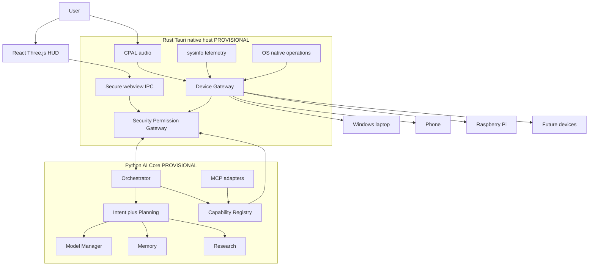

# NAVEEN / JARVIS — Master Architecture

Permanent system blueprint for NAVEEN / JARVIS: a long-term **standalone personal AI assistant and second brain**.

Agent-facing engineering rules: [`../AGENTS.md`](../AGENTS.md).

This document describes the **target architecture**, a **provisional hybrid runtime split**, maps both onto the **current repository**, and records **locked / provisional / open** decisions. It does not choose a permanent LLM, STT, TTS, database, IPC protocol, Python packager, or cloud vendor.

**Status:** documentation and architecture planning only. No Python Core, Device Gateway traits, or host↔core IPC exist in the codebase yet.

---

## 0. Decision classes

| Class | Meaning |
| --- | --- |
| **LOCKED** | Invariants. Violating them is an architecture bug. Change only by revising this document and `AGENTS.md`. |
| **PROVISIONAL** | The hybrid split chosen now: React presentation, Rust/Tauri native host, Python AI Core, secured IPC. Preferred for the next implementation phases; may be revised with an explicit architecture update. |
| **INTENTIONALLY OPEN** | Must remain behind interfaces. Do not hardcode a winner in Core, host, or UI. |

---

## 1. Goals

- A personal assistant that accepts **voice, text, and (later) gesture**, plans work, uses tools, remembers what should be remembered, and researches when it does not know.
- **Modular, provider-independent, model-independent, replaceable, upgradeable, hardware-independent, secure, offline-first.**
- Swap UI, STT, TTS, LLM runtime, memory backend, or device **without rewriting** the capability/security contracts.
- Run usefully on the initial target: **Windows, 8 GB RAM, no NVIDIA GPU, CPU-focused local inference**, **Tamil + English + mixed Tamil–English**, offline-first.
- **Python AI Core must not have unrestricted OS access.** Privileged work always goes through the Security Gateway and Rust Device Gateway.
- Treat security, permissions, and audit as first-class.

## 2. Non-goals

- Embedding cognition in React / Three.js.
- Letting the webview call Python, or Python call the OS, while skipping Rust.
- Hardcoding Gemma, Qwen, Llama, Ollama, whisper.cpp, sherpa-onnx, Kokoro, SQLite, Mem0, or any model filename as “the” implementation.
- Rebuilding whisper, ONNX VAD, llama.cpp, or vector search from scratch.
- Unrestricted self-modification or silent privilege escalation.
- Persisting every utterance into long-term memory.
- Assuming GPUs, unlimited RAM, or always-on network.
- Browser `SpeechRecognition` or STT/LLM inference in the webview.
- Treating Tauri capability JSON as the JARVIS tool registry.
- Installing heavy AI runtimes before IPC and security boundaries exist.
- Shipping cloud-required features as the default path.

---

## 3. Architecture

### 3.1 Logical pipeline (LOCKED)

```text
User
  → Input Gateway          (voice / text / gesture)
  → JARVIS Core / Orchestrator
  → Intent + Planning
  → Context / Memory / Research / Model Manager
  → Capability Registry
  → Security / Permission Gateway
  → Device Gateway
  → Laptop / Phone / Future Devices
```

Privileged operations (LOCKED):

```text
AI Core
  → Capability Registry
  → Security / Permission Gateway
  → Rust Device Gateway
  → Device / OS
```

### 3.2 Provisional hybrid runtime

```text
React / Three.js     presentation client only
        ↕  Tauri IPC (existing webview ↔ host pattern)
Rust / Tauri         native host
                     Device Gateway
                     CPAL / audio device access
                     system telemetry
                     OS / native operations
                     security boundary
                     authentication / authorization
                     permission policy
                     sandbox / isolation
                     secure IPC
                     future device adapters
        ↕  versioned, authenticated, least-privilege IPC
Python AI Core       JARVIS Orchestrator
                     intent understanding
                     planning
                     model manager / router
                     LLM provider adapters
                     memory layer
                     research engine
                     agent / tool orchestration
                     MCP integrations where appropriate
```



**LOCKED:** the HUD is a subscriber/display. It is not on the privileged path.

**LOCKED:** Python Core does not receive unrestricted OS access. It **requests** capabilities; the Rust host **authorizes and executes** device/OS work.

**PROVISIONAL:** cognition in Python; privileged native work in Rust; IPC between them.

**OPEN:** how Python is packaged, which IPC protocol is used, whether Core is one process or several.

### 3.3 Communication rules (PROVISIONAL mechanism, LOCKED policy)

| Hop | Mechanism today | Target policy |
| --- | --- | --- |
| React ↔ Rust | `@tauri-apps/api` `invoke` in `src/services/native/tauriBridge.ts` | Keep; prefer events; Tauri ACL + CSP |
| Rust ↔ Python | **Not implemented** | Versioned schema, authenticated, least privilege, deny-by-default methods |
| React ↔ Python | **Forbidden** | No direct socket, stdio, or HTTP from the webview to Core |

IPC to Python exposes **capability request APIs and cognitive events**, not raw `shell`, arbitrary FS, or an always-on microphone tap.

---

## 4. Layer responsibilities

| Layer | Runtime (provisional) | Responsibility |
| --- | --- | --- |
| **Presentation** | React / R3F | Display; non-privileged input; subscribe to events |
| **Input Gateway** | Host captures audio; Core consumes text events | Normalize voice/text/gesture into one Core inbox |
| **JARVIS Core / Orchestrator** | Python AI Core | Session, turns, routing, UI-bound core events via host |
| **Intent + Planning** | Python | Classify intent, plan steps, request research |
| **Context** | Python | Working context for a turn |
| **Memory** | Python behind `MemoryStore` | Durable/second-brain stores; policy-gated writes |
| **Research** | Python capability | Retrieve, verify, synthesize |
| **Model Manager / Router** | Python | Select `ModelProvider`; resource-aware load/unload |
| **Capability Registry** | Python catalog + host enforcement | Schemas, permissions, risk; **execution of privileged adapters is host-side** |
| **Security / Permission Gateway** | **Rust host** (primary) | Authn/authz, policy, confirm, secrets, audit, network, kill switch |
| **Device Gateway** | **Rust host** | Audio, telemetry, FS, processes, future devices |
| **MCP** | Python client allowed | Must call tools only through Registry + Gateway; OS effects via Rust |

Tauri ACL remains a **webview IPC allowlist**. It is not the JARVIS Capability Registry.

### 4.1 Current repository mapping

| Path | Role today | Target role |
| --- | --- | --- |
| `src/App.tsx` | HUD; polls telemetry; **starts microphone** | Presentation only; subscribe to host events |
| `src/components/hud/` | Glass HUD | Dumb views |
| `src/components/core/` | Nova Core visuals | Visual engine |
| `src/config/theme*.ts`, `visualState.ts`, `visualProfiles.ts` | Theme / visuals | Presentation |
| `src/config/hudModel.ts` | Presentation types | View-model from host/core events |
| `src/config/assistantConfig.ts` | Display names | Branding only |
| `src/state/assistantState.ts` | UX state | Map from core/host events |
| `src/services/native/tauriBridge.ts` | React → Rust `invoke` | Only React↔Rust client |
| `src/services/voice/*` | STT interfaces; stub factory; unwired controller | HUD/host event types; no webview inference |
| `src-tauri/src/lib.rs` | ping, sysinfo, mic commands | Native host + Device Gateway + security + Python IPC supervisor |
| `src-tauri/src/audio.rs` | CPAL RMS; PCM dropped | Audio adapter (PCM → VAD → STT) |
| `src-tauri/capabilities/default.json` | `core:default` | Webview ACL only |
| Python AI Core | **Absent** | Provisional cognition process |
| Host↔Core IPC | **Absent** | Versioned authenticated bus |

---

## 5. Interfaces and boundaries

Core (Python) and host (Rust) share **versioned contracts**, not vendor types.

```text
InputEvent { source: voice|text|gesture, text, locale?, utterance_id }

SttProvider { start, stop, abort; events: partial, final, error }
VadProvider { on_pcm → speech_start / speech_end }
TtsProvider { speak, stop }
ModelProvider { complete | stream }
EmbeddingProvider { embed }
MemoryStore { recall, write, forget, namespaces }

Capability {
  id, input_schema, output_schema,
  permissions[], risk, device_requirements,
  adapter, verification
}

CapabilityRequest  →  SecurityGateway.authorize()
DeviceGateway { audio, telemetry, fs, process, ... }
HostCoreIpc { version, auth, methods[], events[] }
ResourceManager { hardware snapshot; can_load; unload }
```

**Forbidden crossings (LOCKED)**

- React → Python (any channel)
- React → OS privileged API except via Rust
- Webview → PCM / STT / LLM inference
- Python → unrestricted shell, FS, network, or raw microphone
- Capability / MCP adapter → skip Security Gateway
- Hardcoded absolute paths, API keys, model filenames in Core or UI
- HUD `MemoryPanel` → database writes

---

## 6. Data flow

### 6.1 Text turn (target)

```text
User types in HUD
  → Tauri IPC (non-privileged input)
  → Rust host (authn of session; forward)
  → Python Core inbox
  → Intent + Plan
  → Memory / Research / Model Manager as needed
  → Capability request if tools needed
  → Rust Security Gateway
  → Rust Device Gateway
  → Result to Core
  → Events to HUD via Rust
```

### 6.2 Voice turn (target)

See [§8](#8-voice-pipeline).

### 6.3 Current (as implemented)

```text
Mic → CPAL → RMS → JS poll 120ms → VoicePanel
sysinfo → JS poll 2s → SystemPanel
jarvis_ping → "CORE_ONLINE"  (not Core)
STT stub → no-op
Python Core → absent
Rust ↔ Python IPC → absent
```

---

## 7. Security flow (LOCKED policy)

Defense in depth:

```text
Tauri ACL
  + Rust security gateway
  + authentication
  + authorization
  + least privilege
  + capability policies
  + sandbox / isolation
  + secret isolation
  + audit logging
  + network policy
  + safe / offline mode
  + kill switch
  + rollback
```

```text
Request (HUD, transcript, MCP, capability call)
  → Authenticate
  → Authorize (deny by default)
  → Risk class (low / medium / high+confirm)
  → Secrets check
  → Network policy
  → Sandboxed adapter on the host
  → Audit
  → Optional rollback / kill switch
```

The AI must never:

- bypass authentication
- bypass authorization
- grant itself privileges
- disable security controls
- expose secrets
- silently execute arbitrary untrusted code
- modify its own security controls without controlled review

“User said so” is **not** enough for dangerous actions.

Python’s IPC surface is a **short allowlist of methods**, independently of what a model “wants.” Prompt injection on tool output is untrusted input.

---

## 8. Voice pipeline

### 8.1 Target (LOCKED shape)

```text
CPAL
  → PCM pipeline          (Rust Device Gateway)
  → VAD
  → SttProvider
  → text event
  → JARVIS Core           (Python inbox, via host IPC)
```

- Native audio stays **outside the webview**.
- HUD gets levels, VAD state, transcripts, errors — not PCM (except an explicit debug flag).
- TTS uses `TtsProvider` (OPEN implementation).

### 8.2 Candidates (OPEN which one)

| Candidate | Role |
| --- | --- |
| Silero VAD | Utterance gate on CPU |
| sherpa-onnx | Streaming STT candidate |
| whisper.cpp | Offline / quality STT candidate |

Do not rebuild them. Do not lock one. Exact process that **runs** VAD/STT (Rust host vs constrained helper) is **OPEN**; capture remains in Rust; Python does not get unrestricted PCM.

### 8.3 Current voice code

- `src-tauri/src/audio.rs`: RMS; PCM dropped
- `VoicePanel`: display gate, not VAD
- `sttProvider.ts`: no-op; forbids SpeechRecognition
- `VoiceController`: unused
- `App.tsx`: owns mic start — debt

### 8.4 Language

Tamil, English, mixed Tamil–English via **config**, not hardcoded model IDs.

---

## 9. Model architecture (LOCKED interface)

```text
Task
  → ModelRouter / Model Manager     (Python, provisional)
  → ModelProvider adapter
       Ollama
       llama.cpp
       OpenAI-compatible providers
       future local / cloud
```

No model or provider is permanent. **Do not hardcode** Gemma, Qwen, Llama, Ollama, or any filename.

Cloud defaults **off** (network policy). Resource Manager applies on 8 GB CPU-only hardware; future GPU is an adapter/resource fact, not a rewrite of Core.

---

## 10. Memory architecture (LOCKED interface)

First-class, policy-gated. **Do not blindly save every conversation.**

Namespaces: working context, session, long-term, structured knowledge, project, learning, ideas, decisions, goals, preferences, documents.

**OPEN backends (examples, none locked):** SQLite/vector, Mem0, MemPalace, LanceDB, future systems.

Do not confuse hardware RAM, HUD `MemoryPanel`, and `MemoryStore`.

---

## 11. Research architecture

Research is a **capability** in Python Core. Networked fetch is a **host-mediated** permissioned action when it leaves the machine.

```text
Uncertain or possibly stale
  → Research
  → source verification
  → synthesis
  → optional memory
  → response
```

Never assume the LLM is correct or current. HUD weather/data panels are not research.

---

## 12. Capability architecture (LOCKED)

Registry-driven domains (examples): computer, filesystem, browser, coding, research, GitHub, voice, vision, automation, device management.

Each capability: unique ID, input/output schema, required permissions, risk, device requirements, execution adapter, verification strategy.

```text
Python Core requests capability
  → Registry
  → Rust Security Gateway
  → Rust Device Gateway / sandboxed adapter
  → Verify + audit
  → Result to Core
```

MCP: integration protocol only. **Must not bypass** the gateway. MCP must not be given a general OS handle.

---

## 13. Device architecture (LOCKED abstraction)

Device Gateway lives in **Rust**. Hardware-specific logic stays in adapters.

**Current:** Windows laptop, sysinfo telemetry, CPAL microphone.

**Future:** GPU upgrade, phone, Raspberry Pi, other devices.

| Adapter | Today | Target |
| --- | --- | --- |
| Audio | CPAL RMS | PCM + session + permission |
| Telemetry | Blocking `get_system_info` | Background events |
| OS ops | Not present | Gateway-only |
| Python supervisor | Absent | Spawn/auth/kill Core process (OPEN how) |

---

## 14. Frontend (LOCKED)

Stack: React, TypeScript, Vite, Three.js / R3F, Tauri 2 webview.

May: display state/telemetry; non-privileged input; subscribe to events.

Must not: orchestrate; privileged OS; model providers; secrets; mic lifecycle; bypass security; be memory; contact Python.

`assistantState` is UX. Keyboard 1–4 is debug, not intent.

---

## 15. Event architecture

Prefer events: telemetry, audio level, VAD, transcripts, core state, task progress, security prompts.

Path: producer (host or Core via host) → Rust → HUD. Avoid `App.tsx` polling (2s sysinfo, 120ms mic today).

---

## 16. Self-improvement (LOCKED process)

```text
Detect limitation
  → Research
  → Proposal
  → Isolated test
  → Benchmark
  → Approval
  → Deploy
  → Verify
  → Rollback
```

Never unrestricted self-modification. Security controls are not self-writable without review. Isolated tests must **not** run with production Device Gateway privileges.

---

## 17. Development workflow

```text
Architecture / Research
  → Plan
  → Review
  → Agent implementation
  → Tests
  → Build
  → Runtime verification
  → git diff
  → Review
  → Commit
```

Documentation-only work must not modify application source or dependencies.

## 18. Reuse-first policy

Inspect repo → search OSS → license → maintenance → Windows CPU 8 GB → resources → adapter → wrap → scratch only if needed.

**Do not install** Ollama, llama.cpp, sherpa-onnx, vector databases, or a Python ML stack until:

1. IPC method allowlist is specified
2. Capability schemas for the first tools exist
3. Security Gateway deny-by-default behavior is specified
4. Resource policy for 8 GB is specified

Candidates to evaluate later (not lock): sherpa-onnx, whisper.cpp, Silero VAD, llama.cpp, Ollama, OpenAI-compatible local servers, Piper/Kokoro-class TTS, SQLite/vector, Mem0, MemPalace, LanceDB.

---

## 19. Resource policy

**Current hardware:** Windows, 8 GB RAM, no NVIDIA GPU.

**Future:** GPU upgrade, phone, Raspberry Pi — via Device Gateway + Resource Manager, not Core rewrites.

Never assume VRAM. Avoid simultaneous heavy STT + LLM loads. Unload/switch models. Three.js `high-performance` in `NovaCoreScene` does not override the RAM budget.

---

## 20. Testing (when implementation starts)

- Unit / integration / failure paths
- Permission tests for privileged actions
- Contract tests: React↔Rust and Rust↔Python (version skew, auth failure, deny)
- Proof that Python cannot call Device Gateway methods not in the allowlist
- CPU/RAM measurements for local AI

---

## 21. Current implementation status

**Implemented (keep)**

- React 19 + Vite HUD, Nova Core, theme
- UX visual states
- Tauri 2 + `tauriBridge`
- CPAL RMS + sysinfo
- Voice/STT **interfaces** (stub)
- Tauri `core:default` ACL

**Partial**

- Device Gateway (inlined, no traits)
- Voice meter only
- Security (template ACL, `csp: null`, auto-start mic)

**Missing**

- Python AI Core
- Host↔Core IPC
- Orchestrator, memory, research, model manager
- Capability Registry + Rust Security Gateway
- Real STT/VAD/TTS/LLM
- Event bus, multi-device adapters

**Debt (not fixed in this documentation pass)**

- `App.tsx` polling and mic ownership
- Dual visual profile modules / VoiceEngine event shapes
- `jarvis_ping` ≠ Core
- Bundle id `com.tauri.dev`

---

## 22. Proposed implementation order

Establish **architecture and boundaries before heavy AI runtimes**.

1. **Docs freeze** (this document + `AGENTS.md`) — current step.
2. **Contract design only:** Host↔Core IPC version, auth sketch, method allowlist, capability schema template, event list. Still no Python install required if contracts stay in docs.
3. **Harden Rust host (no AI):** bundle id, CSP, mic not auto-started, telemetry as events, Tauri ACL for existing commands.
4. **Device Gateway traits** around existing CPAL + sysinfo (still no STT/LLM packages).
5. **Security Gateway skeleton** in Rust: deny-by-default, audit stub, confirm hook for high risk. First allowed action: read telemetry.
6. **Python Core process skeleton** (minimal interpreter, hello/health over IPC). **No** model download, **no** OS adapters in Python.
7. **End-to-end text path:** HUD text → Rust → Python echo/plan stub → HUD events. Prove React cannot reach Python.
8. **Audio events:** PCM tap + level/VAD events in host; HUD subscribes.
9. **SttProvider adapter** (evaluate sherpa-onnx / whisper.cpp); transcripts into Core inbox. Replaceable config.
10. **Capability Registry** wired to Gateway (filesystem/browser/etc. still denied until explicitly allowed).
11. **Model Manager + Resource Manager** then first `ModelProvider` (Ollama / llama.cpp / OpenAI-compatible — chosen in config, not code constants).
12. **MemoryStore** adapter; then Research capability (network via host).
13. **TtsProvider**; then wake word.
14. **More devices** (GPU, phone, Raspberry Pi adapters).

Do not start with HUD rewrites, cloud APIs, webview ONNX, or unrestricted Python `subprocess` to the shell.

---

## 23. Locked decisions

1. React / Three.js is **presentation only**.
2. Cognition is **not** in `App.tsx` and **not** `jarvis_ping`.
3. Privileged / OS / device operations are **protected** and execute only after Capability Registry + Security Gateway + Device Gateway.
4. Python AI Core **must not** have unrestricted OS access.
5. Modular, provider-independent design: interfaces, adapters, config, registries.
6. **No hardcoded** providers, models, model filenames, databases, tools, hardware, secrets, absolute paths, or cloud requirements.
7. **Security gateway** is mandatory (defense in depth as in §7).
8. **Capability registry** is mandatory; Tauri ACL ≠ registry.
9. **Device abstraction** is mandatory; hardware-specific code in adapters.
10. Voice: CPAL → PCM → VAD → `SttProvider` → Core; **no** webview audio/STT inference; **no** SpeechRecognition.
11. TTS behind `TtsProvider`; memory behind `MemoryStore`.
12. MCP must not bypass the permission gateway.
13. React must not speak to Python except through Rust.
14. Events preferred over HUD polling.
15. Memory is typed and policy-gated — not “save everything.”
16. Research is a capability; LLMs are not assumed current.
17. Deny-by-default; high-risk needs confirmation/authn; no silent self-privilege.
18. Self-improvement: proposal → isolated test → approval → deploy → verify → rollback. Never unrestricted self-modification.
19. Reuse mature OSS behind adapters.
20. Initial envelope: Windows, 8 GB RAM, no NVIDIA; Resource Manager required for local AI.
21. Offline-first; network is permissioned.
22. Architecture/IPC/security boundaries **before** installing heavy AI runtimes.
23. Preserve working HUD/native capture unless intentionally replacing it.

## 24. Provisional decisions

These are the **current hybrid choice**, not eternal locks:

1. **Rust / Tauri** is the native host (Device Gateway, telemetry, OS ops, security boundary, authn/authz, sandbox, secure IPC, future device adapters).
2. **Python** is the AI Core (orchestrator, intent, planning, model manager/router, LLM adapters, memory, research, agent/tool orchestration, MCP client).
3. **Rust ↔ Python** communication is a **versioned, authenticated, least-privilege IPC** boundary supervised by the host.
4. Capability **catalog/orchestration** may live in Python; **authorization and privileged execution** live in Rust.

A future revision may move Core (for example fully into Rust) only by updating these documents. Until then, agents must not implement Core inside React “to go faster.”

## 25. Intentionally open decisions

Do **not** treat these as chosen:

- Exact **Python runtime / packaging** (venv, embedded interpreter, sidecar exe, conda, etc.)
- Exact **IPC protocol** (stdin/stdout JSON, named pipe, local socket, gRPC, protobuf, …)
- Exact **STT** implementation (sherpa-onnx vs whisper.cpp vs other)
- Exact **VAD** packaging
- Exact **LLM runtime** (Ollama vs llama.cpp vs OpenAI-compatible vs other) and model identity
- Exact **memory backend** (SQLite/vector, Mem0, MemPalace, LanceDB, other)
- Exact **TTS** backend
- Exact **orchestration framework** (custom vs a library)
- Where VAD/STT **process** runs (host vs helper), provided it is not the webview
- Authn mechanism (OS session, local credential, …)
- MCP adoption timeline and which servers
- Wake-word engine
- Whether a browser-only demo remains supported
- Visual consolidation of `visualState.ts` vs `visualProfiles.ts`

When an open item is decided, record it as a **replaceable default in config**, never as an unreplaceable constant.

---

## 26. Document control

- **This file** is the system blueprint.
- **`AGENTS.md`** is the short rule set for agents.
- Application source, dependencies, and runtime Core were **not** modified for this hybrid update.
- If implementation diverges, update this blueprint in the same change set as the architecture decision.
